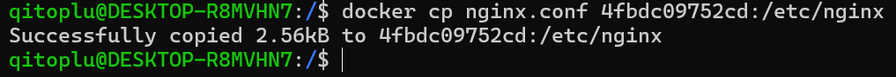
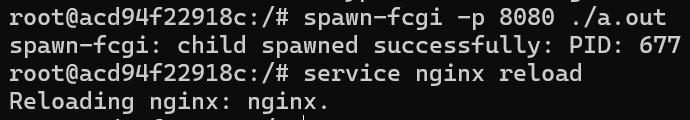

## Часть 1. Готовый докер ##
проверка имаджей и пулим nginx <br>
 <br>
запускаем nginx <br>
 <br>
инспект контейнера <br>
 <br>
необходимые по заданию параметры <br>
 <br>
 <br>
 <br>
остановка контейнера <br>
 <br>
мапим порты <br>
 <br>
проверяем, что работает и рестартим контейнер <br>
 <br>
 <br>
## Часть 2. Операции с контейнером ## 
выводим содержимое файла nginx.conf напрямую из контейнера <br>
 <br>
настраиваем отдачу сервера nginx по /status <br>
 <br>
закидываем nginx.conf в контейнер <br>
 <br>
релоадим nginx и проверяем что все гуд <br>
 <br>
 <br>
экспортируем образ в контейнер <br>
 <br>
удалим имаджи <br>
 <br>
 <br>
```через docker rm удалим контейнер``` <br>
 <br>
 <br>

## Часть 3. Мини веб-сервер ##
```sudo apt update``` <br>
```sudo apt install nginx``` <br>
```sudo apt install nginx-extras``` <br>
меняем в конфиге значение listen на 81 <br>
 <br>
простейшик fcgi кодик <br>
 <br>
запускаем контейнер на 81 порту с образа nginx <br>
 <br>
копируем в контейнер nginx.conf и код fastcgi<br>
 <br>
заходим в контейнер <br>
 <br>
устнавливаем необходимые утилиты <br>
 <br>
 <br>
 <br>
 <br>
компилим код <br>
 <br>
запускаем сервер spawn-fcgi на 8080<br>
 <br>
работает ;-; <br>
 <br>

## Часть 4. Свой докер ## 
написанный докерфайл:<br>
 <br>
билдим <br>
 <br>
проверяем, что работает <br>
 <br>
мапим 81 порт на 80 порт локальной машины и опять проверяем, что все ок<br>
 <br>
 <br>

## Часть 5. Dockle ##
команда для установки на Ubuntu: <br>
 <br>
загоняем на проверку текущий Dockerfile: <br>

исправленный вариант: <br>

все команды с открытыми переменными вынес в баш скрипт, можно было вынести в ENV <br>

проверяем, что все ок <br>


## Часть 6. Базовый docker-compose ##
docker-compose <br>

билдим имадж: <br>

поднимаем контейнеры: <br>

проверяем, что все работает <br>
